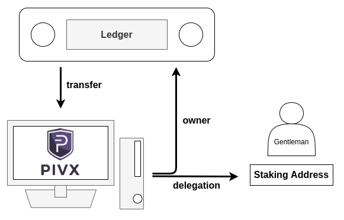
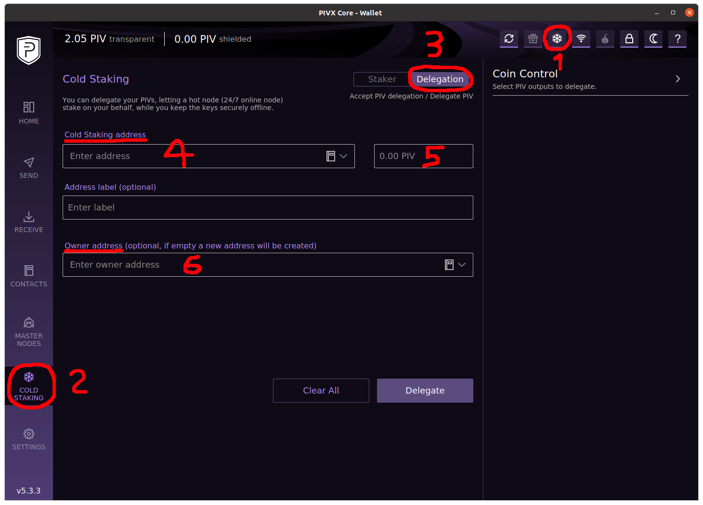
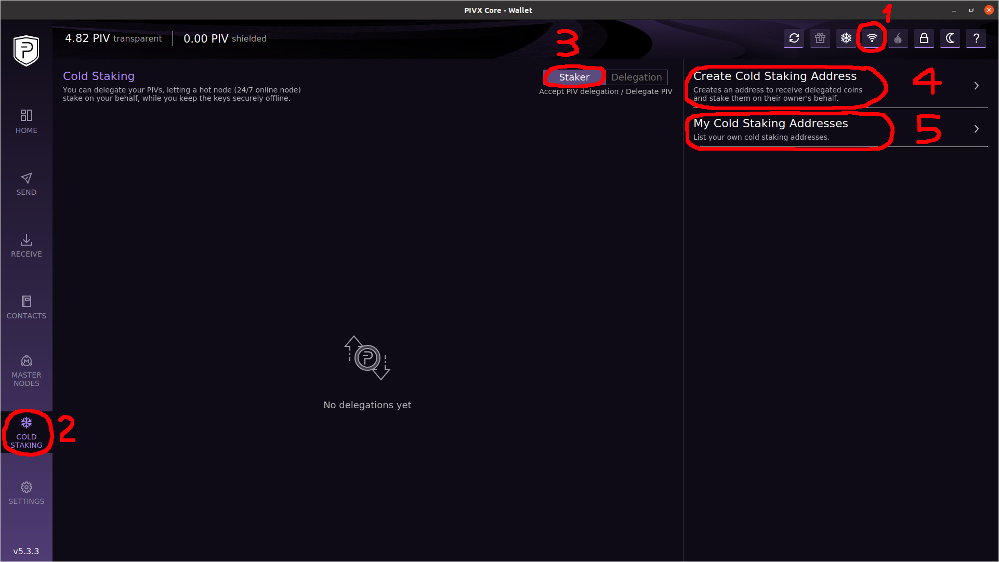

# PIVX Cold Staking Guide for Ledger Nano S/X

## What you need for cold staking your PIV:

1. A wallet, which can be offline (cold) => Ledger Nano S/X  
This wallet will be the "owner wallet/address" because it can access your coins (**KEEP IT SAVE ALL THE TIME!**).

2. The Official PIVX wallet =>  https://pivx.org/downloads  
This is the wallet you need for making the delegation to the staking wallet.

3. A Staking wallet which is online 24/7  
  The staking wallet can NOT access your PIV, so it is also save to delegate your PIV to a stranger (what I did). A gentlemen on Reddit may stake your coins for free (all you need is his staking address and his approval). If you don't want that you can use your official PIVX wallet for staking, if it stays online 24/7 (on a Raspberry PI for example). For this purpose you must generate a staking address inside of your official PIVX wallet.

4. The PET4L Tool => https://github.com/PIVX-Project/PET4L  
The Ledger Live app is not capable to see and spend delegated PIV or create a delegation transaction. That's why you need the PET4L tool when you want to move your PIV after staking.

---

## Process Overview:
1. If you have your PIV on your Ledger, transfer them to your official PIVX wallet (start small).  
This step was the most difficult to "believe/understand" for me, because as a HW (Hardware Wallet) owner you never want your coins leaving your HW. This is necessary until the Ledger will be supported by the official PIVX wallet for signing delegation transactions or until Ledger Live will be supporting it. But don't worry too much because the delegation transaction will move your coins immediately to the owners address (which you choose to be your HW). So the coins will be "online" for a very short amount of time (less than ~1 minute).

2. Next you need the staking address. As already explained above, you can generate your own, or you can ask someone else on Reddit/Discord for his staking address and his approval.

3. Sign and broadcast a delegation transaction on your official PIVX wallet (which contains all the funds, because of step one). This transaction will move the funds to your HW  

  

---

## Let's Do It

I assume you have already transferred all your PIV from the Ledger to the official PIVX wallet.

1. Enable cold staking in your PIVX wallet by clicking on the snowflake as depicted in the figure below.
2. Click on the "**Cold Staking**" section
3. Click on the "**Delegation**" tab
4. Enter the staking address you got from someone else (or your own - explained in the next section)
5. Enter how much PIV you would like to stake (consider transaction fees)
6. Enter your Ledger address (Open Ledger Live and copy your PIVX receive address which will be your **owner address**)
7. Click **Delegate** (This will create the delegation transaction which moves your funds immediately to the **owner address**)

After the gentleman, you got the staking address from, has approved your delegation, you will start receiving rewards (Can take some time, dependent on how much PIV you have delegated)

8. You will notice that your PIV won't show up in Ledger Live despite using its address as the owner address. That's because Ledger does not know the type of transaction which is used to transfer.

  

---

## I don't trust any stranger

You are right. It's always better to run your own staking wallet. The only difference to the process explained above is that you will crate and use your own staking address, instead of someone else's address when doing the delegation.

1. Enable cold staking in your PIVX wallet by clicking on the snowflake as depicted in the figure below.
2. Click on "**Cold Staking**" section
3. Click on the "**Staker**" tab
4. Click on "**Create Cold Staking Address**" and follow the instructions.
5. Click on "**My Cold Staking Addresses**" and then you will see the address you just created. Copy that address by clicking on it and use it as the "Cold Staking Address" when doing your delegation as explained above.
Don't forget to approve the delegation, which will show up in the "**Staker**" tab.

  

---

## Moving Your Staked PIV

Your staked PIV wont show up in the Ledger Live app (this hopefully changes in the future), therefore you need the PET4L tool (https://github.com/PIVX-Project/PET4L) if you want to move your staked coins. This tool helps you to create the proper transaction and send it to the Ledger for signing it. How to use the tool is well explained by its documentation (just make sure you have the PIVX app on the Ledger open, when trying to connect to the HW).

---

References:  
1. https://forum.pivx.org/threads/a-pivx-cold-staking-how-to.745/
2. https://forum.pivx.org/threads/how-to-setup-cold-staking-with-ledger-hardware-wallet.650/
